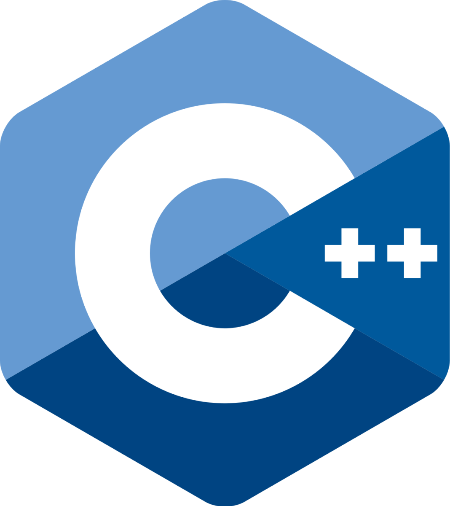
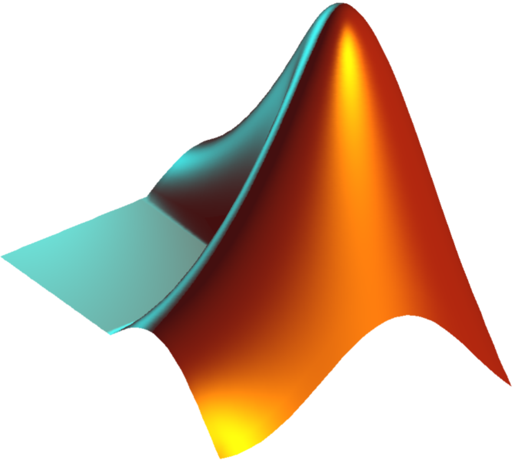
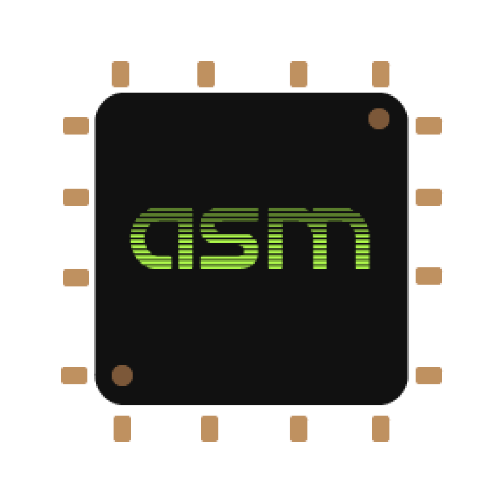

  
  
### I'm Drew, just a guy who likes mathematics and the things you can do with it.
- 💻 Data Scientist @ IBM  
- 🔭 Working on an interactive render engine for mathematical education  
- 🌱 Learning the mathematics behind machine learning and artificial intelligence algorithms  
- ⚡ I use tabs over spaces  
  
   

## The Stuff I Use

### Languages (in order by most to least favorite)

  

### Frameworks / Libraries

  

### Cloud

  
### Software

  
### Misc

## Look Me Up

  

  
  

   

## Github Stats  

   
  

   

## What I'm Working To 

  

   

## Look Mom I'm Popular

 

